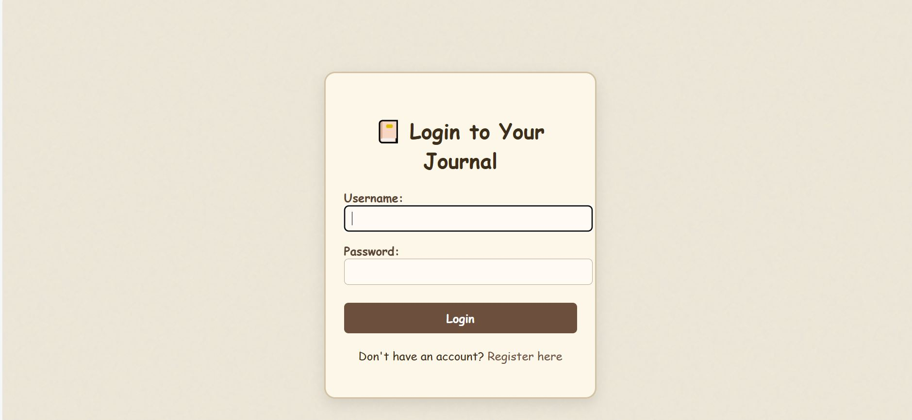
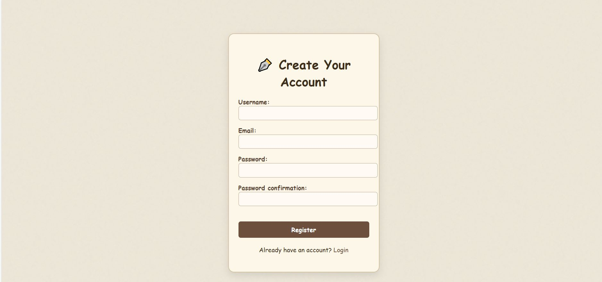
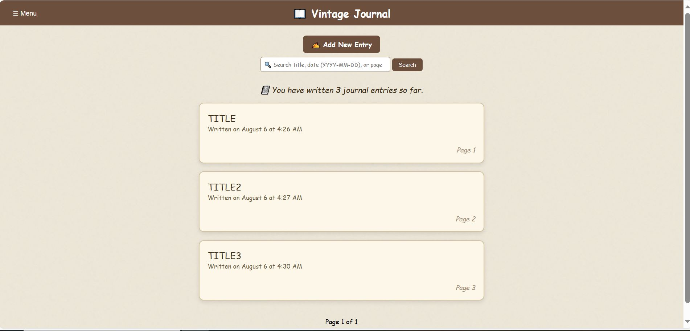
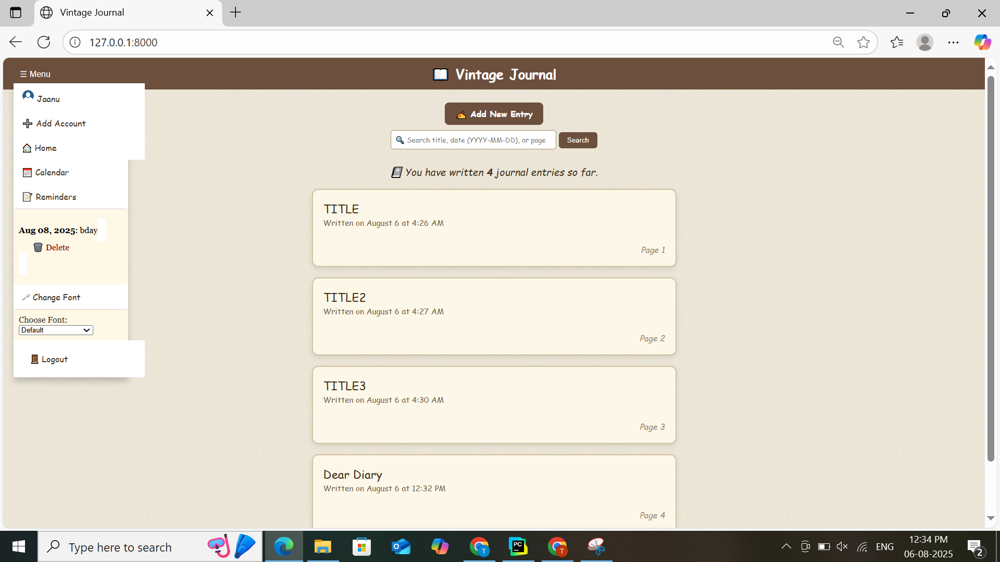
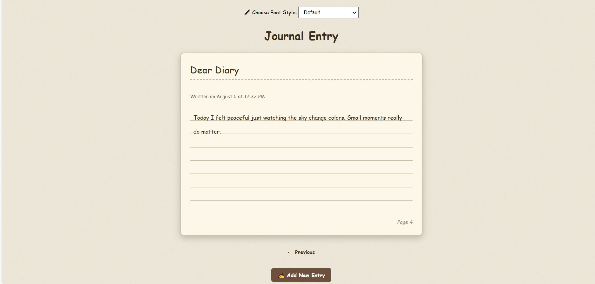
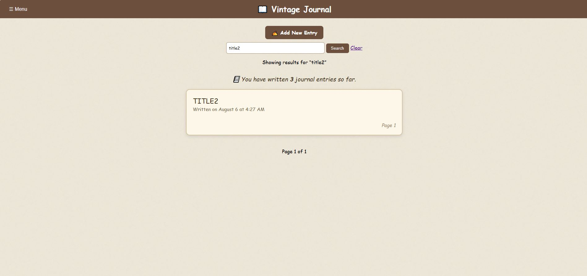

## JournalProject
📝 Journal Diary – Digital Journal Web App
Journal Diary is a clean and simple digital journal web application designed for users to write, manage, and reflect on their daily thoughts or memories. With a focus on minimalism and functionality, this project provides features like secure login, daily entry tracking, and keyword-based search — all packed in a user-friendly dashboard.

# 🔍 Key Features
✍️ Add Journal Entries – Write and save personal thoughts with timestamps.

🔐 User Authentication – Register and log in securely.

🧠 Search Entries – Instantly find previous entries using keywords.

📅 Dashboard View – See all your journal logs at a glance.

📲 Clean UI/UX – Built with simplicity and ease of use in mind.

# 📌 Built With
Frontend: HTML, CSS, JavaScript (or React if applicable)
Backend: Django (or Node.js, Flask, etc., if you're using another stack)
Design: Figma prototypes
Version Control: Git & GitHub

---
## Screenshots
| Screen | Description |
|--------|-------------|
|              | User login screen |
|        | User registration page |
|      | User's main dashboard view |
|                | Main navigation menu |
|  | Add a new journal entry |
|            | Search through journal entries |

---

## Features

- **Add Journal**: Users can create and save a new journal entry.  
- **Search**: Users can search through existing entries by keyword or date.  
- **User Authentication**: Includes user registration and login screens.  
- **Navigation Menu**: Menu layout for seamless navigation across the app.  
- **Dashboard**: Overview of all entries, stats or recent activity (mock‑up).

---

## Installation / How to Run

1. Clone the repository:  
   ```bash
   git clone https://github.com/Thammisetty-Jahnavi/Journal-Diary.git
     
